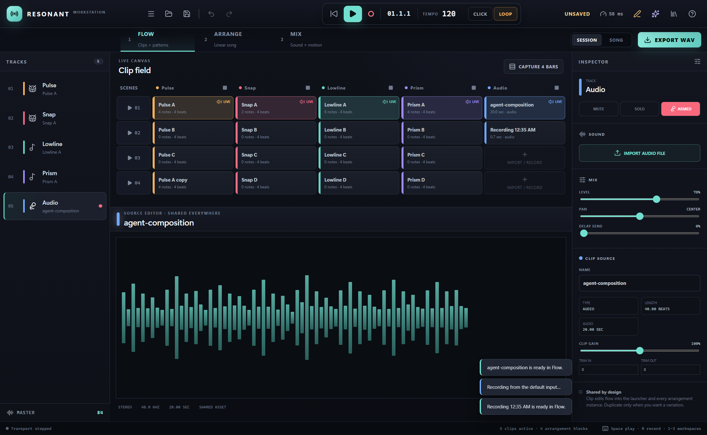
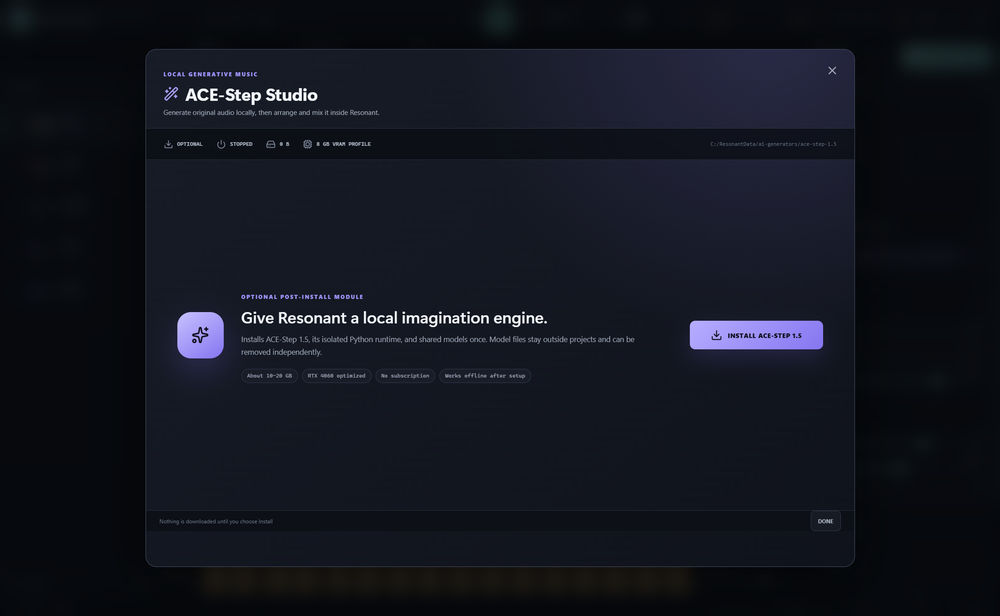
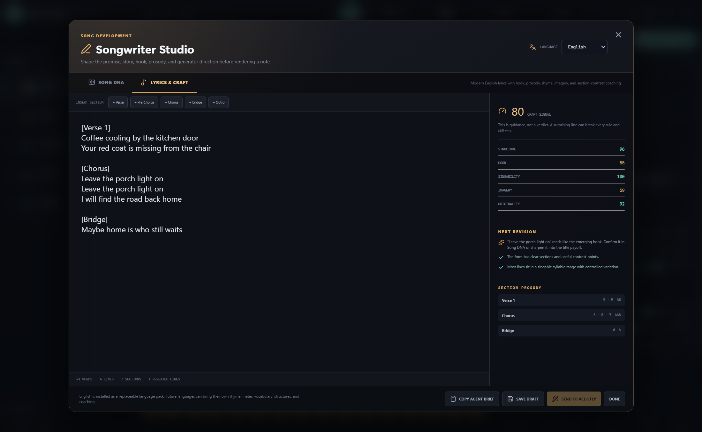
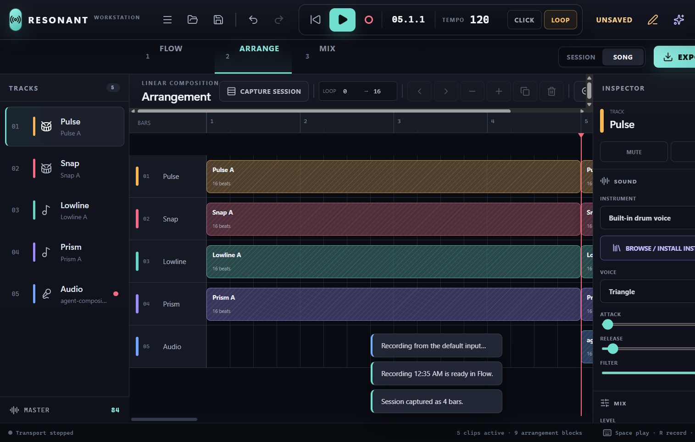
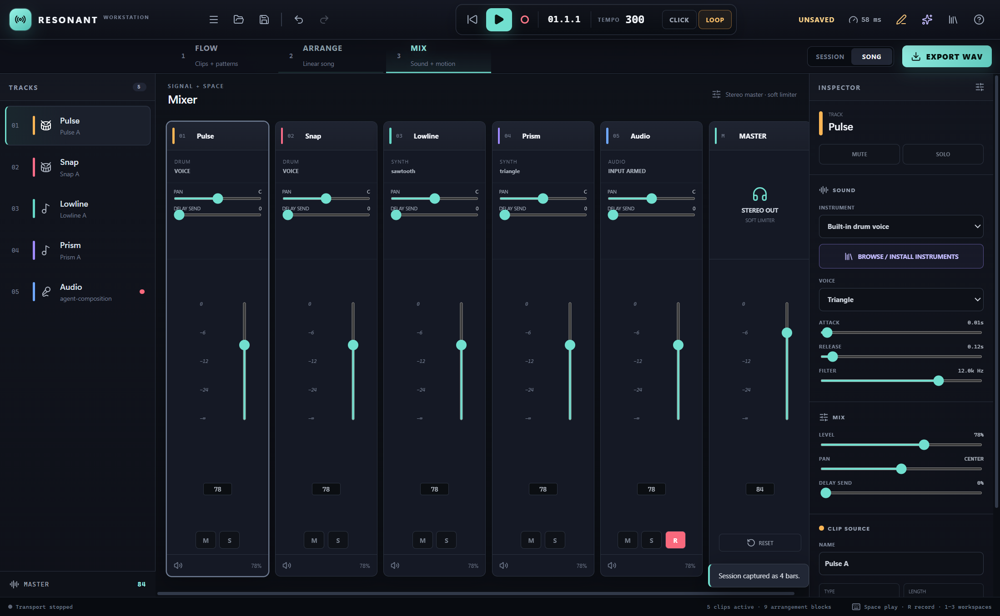
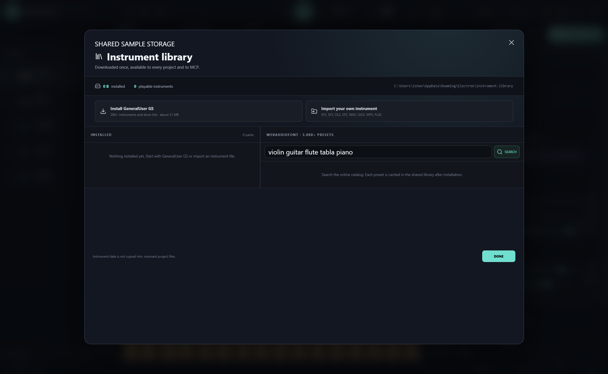
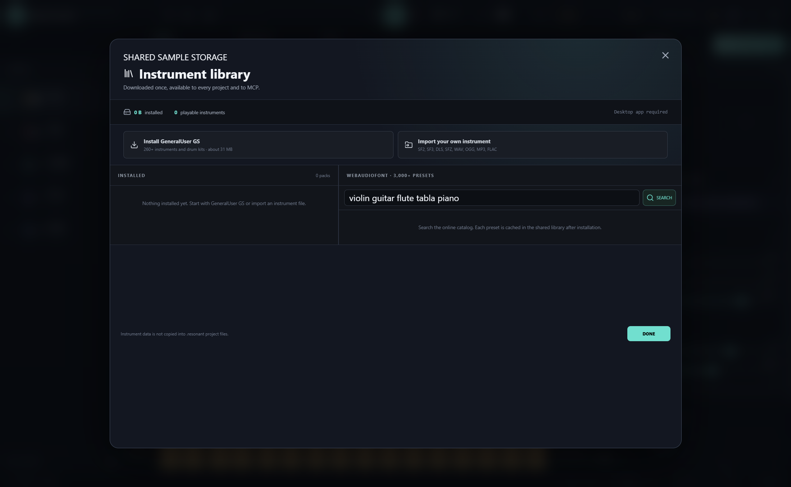

<div align="center">

<picture>
  <source media="(prefers-color-scheme: dark)" srcset="docs/assets/brand/reso-lockup-dark.svg">
  
</picture>


## Make complete songs locally.

**Generate vocals or instrumentals. Multiple languages supported. Play real instruments. Arrange, mix, and export—all on your computer.**

Resonant is a free, open-source AI music studio and production workstation for Windows. Think of it as a local alternative to cloud music generators such as Suno, with a real clip launcher, arrangement timeline, instrument library, mixer, and an MCP server for AI assistants.

**Produce your own club music — _Chrome Roller Rink: Midnight Club Mix_:**

https://github.com/user-attachments/assets/5fc4d9a5-a42f-4366-b969-bbaf4122da7a

**Or create complete songs with a single prompt — _Kitchen Light_:**

https://github.com/user-attachments/assets/6ac52777-6892-420a-88de-8c71416610d3

**No credits. No subscription. No cloud upload. Create as much as your hardware can handle.**

**Your songs stay yours—no company ownership, watermark, or royalties. Use them however you like.**

[**Download for Windows**](#install-resonant) · [**Connect Codex or Claude**](#turn-your-ai-assistant-into-a-music-producer) · [**Explore the features**](#from-first-idea-to-finished-wav)


</div>



> If Resonant helped you make something, dropping a ⭐ on the repository would help other musicians discover it too.

## From first idea to finished WAV

Resonant brings the stages of making music into one continuous workflow:

- **Write:** develop a hook, story, structure, rhyme, imagery, and generator-ready lyrics in Songwriter Studio.
- **Generate:** optionally use ACE-Step 1.5 to create a complete original vocal song or instrumental locally.
- **Compose:** program drums, synths, sampled instruments, melodies, chords, and automation.
- **Perform:** launch clips and scenes, improvise combinations, and capture the performance into a song.
- **Arrange:** turn shared musical ideas into a complete linear structure without duplicating the source material.
- **Mix:** control levels, pan, delay, mute, solo, automation, master limiting, and headroom.
- **Finish:** analyze the mix, check vocal/lyric delivery, save safely, and export a deterministic stereo WAV.

You can begin with a blank project, an imported recording, a MIDI idea, written lyrics, an AI prompt, or a request to your favorite coding assistant.


## Turn your AI assistant into a music producer

Resonant ships a local [Model Context Protocol](https://modelcontextprotocol.io/) server. An MCP-capable assistant can understand the workstation’s full feature set and operate saved projects through focused, revision-safe music tools.

Ask for an outcome instead of manually programming every step:

> Use Resonant to write an original alternative-soul song about rebuilding trust. Create the lyrics, generate a restrained vocal performance, arrange it into a full song, leave sensible mix headroom, analyze the result, and export the final WAV.

### Connect Resonant through MCP

**Fastest setup — ask your AI assistant:** give an MCP-capable coding assistant this repository URL:

[https://github.com/calesthio/Resonant](https://github.com/calesthio/Resonant)

Then copy and send this prompt:

> Set up Resonant's local MCP server for me using the current instructions in that repository. Preserve and merge any existing MCP configuration instead of replacing it. Ask me which folder should be used as my music workspace, then verify the connection by calling `get_capabilities` after I restart you.

The assistant can prepare the configuration, but you still choose the authorized music workspace and restart the assistant when prompted. To configure it manually instead:

1. Launch Resonant and open **Quick Start → Connect Codex, Claude, or another AI assistant**.
2. Choose the folder containing your `.resonant` projects. The assistant will only be allowed to read and write inside this folder.
3. Select your client and copy the configuration Resonant generates:

   - **Codex:** paste the TOML block into `.codex/config.toml` in your trusted project, or merge it into your user-level Codex configuration.
   - **Claude Code:** save or merge the JSON as `.mcp.json` in the project folder.
   - **Cursor or another MCP client:** choose **Any MCP client** and use the generated STDIO JSON in that client's MCP settings.

4. Restart the assistant. In Codex or Claude Code, run `/mcp` and confirm that `resonant` is connected.
5. Save or open a `.resonant` project, then ask the assistant to call `get_capabilities`. You can now request complete songs, lyrics, composition, instruments, arrangement, mixing, analysis, or WAV export in plain language.

The Windows installer includes the MCP runtime and Resonant's bundled Node environment, so installed users do not need Node.js. When running from source, run `npm ci` and `npm run build:mcp` first; the repository already includes starter Codex and Claude configurations.



Agent writes are confined to the folder you choose, require current project revisions, and keep bounded undo history. Audio payloads are not returned to the language model. See the complete [agent-mode contract](docs/agentic-mode.md).

## A workstation, not just a generator

### Real instruments and a general-purpose sampler

Install the 287-preset GeneralUser GS SoundFont, search more than 3,000 WebAudioFont presets, or import SF2, SF3, DLS, SFZ, WAV, OGG, MP3, FLAC, and M4A instruments. Build with piano, violin, guitar, flute, tabla, orchestral sections, world instruments, drums, synths, and your own samples.

Instrument packs are stored once and reused across every project. Missing instruments fall back safely to a built-in voice instead of corrupting the song. Read the [instrument library guide](docs/instruments.md).

### Local AI songs with ACE-Step

Open **ACE-Step Studio** to install the optional local generator. Give it a musical direction, lyrics, tempo, duration, and vocal/instrumental choice. The generated performance appears on Resonant’s Audio track, ready for arrangement and mixing.

The recommended Windows laptop profile uses ACE-Step 2B Turbo, the 0.6B planning model, PyTorch, CPU offload, and batch size 1. An NVIDIA GPU with roughly 6–8 GB VRAM is recommended. The initial model download is large; generation runs locally afterward.

### Songwriter Studio

Develop the song before spending generation time. Songwriter Studio provides section blueprints and live coaching signals for structure, hook strength, approximate singability, imagery, originality, rhyme, and contrast. Repeated choruses and refrains are understood as intentional structure rather than filler.

Six replaceable songwriting packs ship with Resonant: English, Hindi/Hindustani, Standard Mandarin Chinese, Korean/K-pop, Latin American Spanish, and Japanese/J-pop. They are not translated copies of one generic prompt. Each brings native section language, genre-specific structures, meter and rhyme analysis, register and code-switching guidance, and culturally relevant revision signals. The architecture allows future languages and regional varieties to add their own craft without forking the editor. See [songwriting language packs](docs/songwriting-language-packs.md).

## Inside Resonant

| Flow | Songwriter Studio |
| --- | --- |
|  |  |

| Arrange | Mix |
| --- | --- |
|  |  |

| Local AI | Instrument Library |
| --- | --- |
|  |  |

## Install Resonant

### Option 1 — Windows installer or portable build (unsigned)

1. Open this repository’s **Releases** page and choose the latest release.
2. Download `Resonant-Setup-x.y.z-Windows-x64.exe`.
3. Run the installer and choose the installation folder.
4. Launch Resonant and start with the built-in groove, install real instruments, or optionally install ACE-Step.

The builds are currently unsigned. Windows SmartScreen may show an “unrecognized app” warning; choose **More info → Run anyway** only after confirming the filename and SHA-256 checksum published with the release.

A portable Windows executable and `SHA256SUMS.txt` are included with every release. The installer launches faster and provides a stable installed path for MCP clients, but both prebuilt executables remain unsigned until project code signing is introduced.

### Option 2 — clone and run from source

This is the most transparent option while the downloadable Windows builds are unsigned: Git downloads the public source, npm installs the locked dependencies, and the application is built and launched on your own machine.

Requirements: [Git for Windows](https://git-scm.com/download/win) and [Node.js 22 or newer](https://nodejs.org/).

On this GitHub repository page, select **Code → HTTPS** and copy the repository URL. Then open PowerShell and run:

```powershell
git clone REPOSITORY_HTTPS_URL resonant
cd resonant
npm ci
npm run check
npm run build
npm run dev
```

Replace `REPOSITORY_HTTPS_URL` with the URL copied from GitHub. `npm run check` runs the validation and test suite, `npm run build` creates the production application and MCP server, and `npm run dev` opens Resonant. Keep that PowerShell window open while Resonant is running; press **Ctrl+C** there to stop it.

For later launches, you only need:

```powershell
cd path\to\resonant
npm run dev
```

If you prefer not to install Git, download **Code → Download ZIP**, extract it, open PowerShell in the extracted folder, and start from `npm ci`.

### Requirements

- Windows 10 or 11, x64
- Base workstation: modern multi-core CPU and audio output
- Local AI generation: NVIDIA GPU with approximately 6–8 GB VRAM recommended, plus substantial free disk space for the optional runtime and models
- No account, API key, subscription, or internet connection after optional downloads complete

macOS and Linux builds are not currently published.

## Essential controls

- **Space:** play or pause; **R:** start or stop input recording; **1 / 2 / 3:** switch between Flow, Arrange, and Mix.
- **Ctrl+S / Ctrl+Shift+S:** save / save as; **Ctrl+O:** open; **Ctrl+Z / Ctrl+Y:** undo / redo.
- **Flow:** launch clips, draw notes, adjust velocity, and capture four bars into Arrange.
- **Arrange:** place, move, resize, duplicate, and remove clip references on the song timeline.
- **Recording:** select and arm the Audio track, then press **R**. Windows microphone permission must allow Resonant.
- **Export WAV:** render the arrangement—or the current launched session when the arrangement is empty.

## Local-first by design

Resonant sends no music, recordings, lyrics, project data, prompts, or analytics to a hosted Resonant service. Network access is used only when you explicitly download instruments, ACE-Step, model files, or other optional resources.

Recorded and imported audio is stored once in a content-addressed shared library. Projects keep a small hash reference, avoiding huge duplicated project and history files. Saves are atomic, autosave recovery is explicit, and older embedded-audio projects remain readable.

## Open source

[](LICENSE)

Resonant is licensed under the [GNU Affero General Public License v3.0](LICENSE). You can inspect it, modify it, run it locally, and share your improvements under the same license.

Copyright © 2026 Resonant and Calesthio. Resonant is licensed under **AGPL-3.0-only**.

The AGPL covers the Resonant software—not the music, lyrics, recordings, or other creative output you make with it. Resonant contributors claim no ownership in user-created output and impose no royalty, attribution, watermark, trademark, or copyleft requirement on it. You may use, modify, publish, license, sell, or keep your output private, including commercially.

This does not grant rights in imported samples, instrument banks, model files, voices, lyrics, or other third-party material. Their respective licenses and applicable laws still apply. Resonant does not guarantee that generated output is unique, non-infringing, or eligible for copyright protection. See [third-party notices](THIRD_PARTY_NOTICES.md).

Contributions are welcome after the public repository opens. Useful starting points include additional songwriting language packs, sampler formats, DSP, accessibility, test coverage, and platform packaging.

---

<div align="center">

**Your ideas. Your machine. Your music.**

</div>
